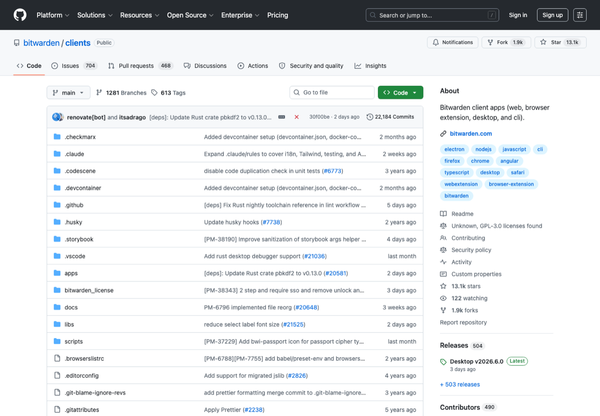

# 中文隐私安全与密码管理工具箱

安全工具不是给极客摆着看的。密码复用、邮箱乱绑、恢复码乱放，这些普通问题比高级攻击更常见。

先把密码管理器和两步验证用起来，胜过收藏一堆隐私工具列表。

## 先看这几个

Privacy Guides / Bitwarden / KeePassXC / Proton Mail

Bitwarden/KeePassXC 二选一，重要账号全开 2FA，然后查一次 Have I Been Pwned。

## 入口

| 名称 | 我为什么留它 |
| --- | --- |
| [Privacy Guides](https://www.privacyguides.org/) | 隐私工具和建议总入口。 |
| [Bitwarden](https://bitwarden.com/) | 密码管理器。 |
| [KeePassXC](https://keepassxc.org/) | 本地开源密码库。 |
| [Proton Mail](https://proton.me/mail) | 注重隐私的邮箱服务。 |
| [Signal](https://signal.org/) | 端到端加密通讯。 |
| [Tor Browser](https://www.torproject.org/) | 匿名网络浏览器。 |
| [Have I Been Pwned](https://haveibeenpwned.com/) | 数据泄露查询。 |
| [age](https://github.com/FiloSottile/age) | 简单现代的文件加密工具。 |

## 我的使用顺序

- 先启用密码管理器和两步验证。
- 重要账号使用独立邮箱和独立密码。
- 定期查泄露并轮换密码。

## 别踩坑

- 不要复用密码。
- 不要把 2FA 恢复码放在同一个云笔记里。

## 截图来源

这张图来自公开页面：[https://github.com/bitwarden/clients](https://github.com/bitwarden/clients)。如果页面改版，截图可能会和当前官网略有出入。

## 维护方式

链接数据放在 [`data/links.json`](data/links.json)。我倾向于少而准：入口失效就换，说明过时就改，不把这里做成什么都往里塞的大杂烩。

## License

MIT. 第三方商标、页面截图和网站内容归原权利方所有；本仓库只做中文导航和使用笔记。
